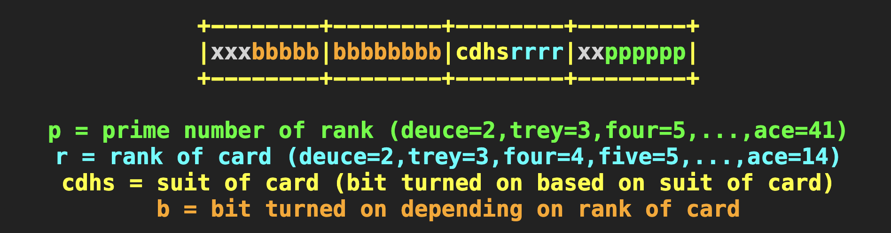

# Poker game implementation

# Technologies
- Fisher–Yates shuffle
- Raylib

## [Cactus Kev's Poker Hand Evaluator](http://suffe.cool/poker/evaluator.html)
- what he found was that though there is 2.6 million poker hand combinations, they collapse into only 7462 distinct hand values
- ranks are converted to prime numbers, their multiplication is unique

- I have used his look up table and some of his logic

# Basic poker rules

# Notes on poker rules
- follows the [Texas hold 'em](https://en.wikipedia.org/wiki/Texas_hold_%27em)
- doesn't burn cards (it is unnecessary in digital poker)
- doesn't implement a side pot for simplicity (players play for all the money, no sub plotting)
- note that my rules may be flawed, I am not a Poker expert
- blinds are increased with every turn to make the game as intense as possible
- no short blinds

# Hand values