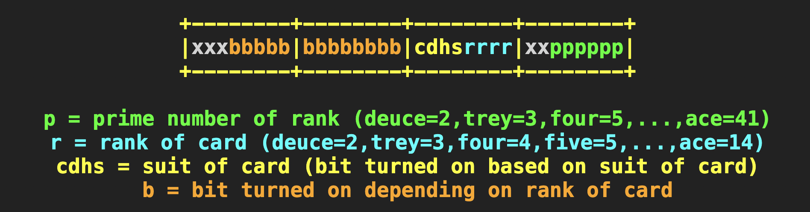

# Poker game implementation

# Technologies
- Fisher–Yates shuffle
- Raylib
- C for Poker implementation
- Python for bots and simulations (easier to handle high level logic, also for educational purposes to learn about combining multiple languages in one project)

## [Cactus Kev's Poker Hand Evaluator](http://suffe.cool/poker/evaluator.html)
- what he found was that though there is 2.6 million poker hand combinations, they collapse into only 7462 distinct hand values
- ranks are converted to prime numbers, their multiplication is unique

- I have used his look up table and some of his logic
- his code is distinctly marked, only mild adjustments have been made to fit into the overall code

# Basic poker rules

# Notes on poker rules
- follows the [Texas hold 'em](https://en.wikipedia.org/wiki/Texas_hold_%27em)
- doesn't burn cards (it is unnecessary in digital poker)
- doesn't implement a side pot for simplicity (players play for all the money, no sub plotting)
- note that my rules may be flawed, I am not a Poker expert
- blinds are increased with every turn to make the game as intense as possible
- short blinds have a slight tweak for simplicity (their bet overrides the blind, other players match the bet, not the blind)
- deck is shuffled before every hand to avoid card counting

# Hand values

# Communication protocol
1. Engine awaits "make a move:" which proceeds with a newline with the index of the player.
2. Engine can play one of the following moves:
- raise
- all in
- call
- check
- fold
+ 1 - get cards (suit+rank, "end" to determine the end of card list)
+ 2 - get bank
+ 3 - get bet
+ 4 - get eval
3. Get a response:
- "successfully played" or "invalid"

3. round ended proceeds with this msg:
- [list of winners] ~ [chips in banks]